# env1 功能流程图（当前线上版本）

> 整理时间：2026-08-26
> 范围：env1 现有功能链路（云函数 + 数据集合读写）。env2 重生成链路（regenDish / resyncRegen / syncImage / listRegen / cleanRegenAfterSync）已在 `manageEnv2Regen` 注释中明确**废弃**，图中归入「废弃/不连通」分支。
> 目的：定位链路断裂点。图后列「潜在断裂点排查清单」。
> 本图用 mermaid 绘制；若阅读器不渲染 mermaid，请看图下的「纯文本速读版」。

---

## 一、总览图（mermaid）

```mermaid
flowchart TD
    U[用户]

    subgraph READ[用户侧读功能]
        REC[getRecommendation 推荐周计划剩菜]
        CG[getCookGuide 看做法]
        DI[getDishImage 看图片]
    end

    subgraph PENDING[待审核池 pending]
        LP[dish_lexicon_pending]
        NP[dish_nutrition_pending]
        GP[dish_guide_pending]
        IP[dish_image_pending]
        PP[dish_ai_profile_pending]
    end

    subgraph SHARD[主库与规范分表]
        LEX[dish_lexicon 主库]
        NUT[dish_nutrition_v2]
        IMG[dish_image_v2]
        ST[dish_steps]
        ING[dish_ingredients]
        RV[dish_review]
        TP[dish_tips]
        PR[dish_profile]
        RC[dish_recommend]
    end

    subgraph BIZ[业务自有集合]
        CV[cook_viewed]
        FC[fav_count]
        UP[user_preferences]
        EX[dish_exposure]
        SC[sys_config]
    end

    subgraph DEAD[废弃不连通]
        RG[env2重生成系列 已废弃]
        CGO[cook_guides旧表 不存在]
    end

    U --> REC
    U --> CG
    U --> DI

    REC --> NUT
    REC --> LEX
    REC --> EX
    REC --> UP

    CG --> ST
    CG --> ING
    CG --> RV
    CG --> TP
    CG --> NUT

    DI --> IMG

    CG -. 首次无做法则AI生成 .-> ST
    CG -. AI双写分表不打待审 .-> ING
    CG -. AI双写分表不打待审 .-> RV
    CG -. AI双写分表不打待审 .-> TP
    DI -. 首次无图则AI生成 .-> IMG

    ML[manageLexicon.approve] --> LP
    ML --> NP
    ML --> GP
    ML --> IP
    ML --> PP
    ML --> LEX
    ML --> NUT
    ML --> ST
    ML --> RV
    ML --> TP
    ML --> ING
    ML --> PR
    ML --> RC
    ML --> IMG

    M2R[manageEnv2Regen.batchApprove] --> LP
    M2R --> NP
    M2R --> GP
    M2R --> IP
    M2R --> PP
    M2R --> LEX
    M2R --> NUT
    M2R --> ST
    M2R --> RV
    M2R --> TP
    M2R --> ING
    M2R --> IMG

    LP -->|approve| LEX
    NP -->|approvePending| NUT
    GP -->|approvePending| ST
    GP -->|approvePending| ING
    GP -->|approvePending| RV
    GP -->|approvePending| TP
    GP -->|approvePending| RC
    IP -->|approvePending| IMG
    PP -->|approvePending| PR

    CG --> CV
    REC --> UP
    REC --> SC
    DI --> SC

    CGO -. checkSevenPiece容错 .-> CG
```



### 纯文本速读版（不渲染 mermaid 时看这里）

```
读链路（用户侧）
  用户 --看做法--> getCookGuide --读--> dish_steps 分表
        └ 分表无做法? --> AI生成 --> 双写 dish_steps / ingredients / review / tips / nutrition_v2（不打待审）
  用户 --看图片--> getDishImage --读--> dish_image_v2
        └ 无图? --> AI生成 --> 直接写 dish_image_v2（不打待审）
  用户 --推荐--> getRecommendation --> 读 营养/主库/曝光/偏好 --> 写 曝光/偏好/反馈

写链路（管理员审核）
  manageLexicon.approve / manageEnv2Regen.batchApprove
        --> 消费 各类 pending --> 入 dish_lexicon(主库,含norm_id) + 各分表
```

> 实线 = 主链路；虚线 = AI 生成回流（延迟写）。①② 读功能、③ 待审核池、④ 主库分表、⑤ 业务自有、⑥ 废弃。

### 图例

- `──▶` 实线 = 主链路读写
- `- -▶` 虚线 = AI 生成触发的回流写入（延迟写，非每次请求都走）
- ①~⑥ 为功能分区

```
                                 用户
                                  │
          ┌───────────────────────┼───────────────────────┐
          │                       │                       │
          ▼                       ▼                       ▼
   ① 用户侧读功能              ① 用户侧读功能            ① 用户侧读功能
   getRecommendation        getCookGuide(看做法)      getDishImage(看图片)
   (推荐/周计划/剩菜)              │                       │
          │                       │                       │
   读:营养/主库/曝光/偏好    读:做法分表(按nid)       读:图片分表
   写:曝光/偏好/反馈        写:做法/食材/评价/贴士     写:图片分表
                              (ai-gen 双写)            (ai-gen 直接写,不打待审)
              │                │  │  │  │                │
              │                │  │  │  │                │
              ▼                ▼  ▼  ▼  ▼                ▼
   ④ 主库与规范分表 ─── ④ 主库与规范分表 ───── ④ 主库与规范分表
   dish_lexicon          dish_steps            dish_image_v2
   dish_nutrition_v2     dish_ingredients       (无其他分表)
   dish_recommend        dish_review
   dish_profile          dish_tips

   ─────────────────────── 首次访问的 AI 回流 ──────────────────────
   getCookGuide: 分表无做法 → AI 生成 → 双写 dish_steps/ingredients/review/tips
                              + 写 dish_nutrition_v2(营养四元组,2026-08-26 已修复)
                              ⚠ 不进 dish_lexicon_pending(做法不审核,与图片对齐)
   getDishImage:  分表无图 → AI 生成 → 直接写 dish_image_v2(不打待审)

   ┌──────────────────────── ② 入库审核写功能 ───────────────────────┐
   │  manageEnv2Regen.batchApprove    manageLexicon.approve          │
   │  adminGeneric(通用读写)                                           │
   └───────────────┬───────────────────────┬──────────────────────────┘
                   │ 消费 pending           │ 消费 pending
                   ▼                        ▼
   ③ 待审核池 pending            ③ 待审核池 pending
   dish_lexicon_pending          dish_nutrition_pending
   dish_guide_pending            dish_image_pending
   dish_ai_profile_pending       (env2 防御黑名单 rejected_names)
                   │                        │
                   │ approve                 │ approvePending
                   ▼                        ▼
   入库: dish_lexicon(主库)     入库: dish_nutrition_v2
         + 各分表               dish_steps/dish_ingredients
         + norm_id(2026-08-26    dish_review/dish_tips
           已补)                dish_image_v2 / dish_profile

   ⑤ 业务自有集合(读写附属): cook_viewed / fav_count / user_preferences
                           dish_exposure / sys_config / dish_feedback

   ⑥ 废弃不连通: env2 重生成系列(已废弃) / cook_guides 旧表(不存在)
```

### 主链路箭头速查（ASCII 不便画全，用表列）

| 起点              | 终点                                 | 类型   | 说明                        |
| --------------- | ---------------------------------- | ---- | ------------------------- |
| 用户              | getRecommendation                  | 读    | 推荐/周计划/剩菜                 |
| 用户              | getCookGuide                       | 读    | 看做法（默认）                   |
| 用户              | getDishImage                       | 读    | 看图片（默认）                   |
| getCookGuide    | dish_steps/ingredients/review/tips | 写(实) | ai-gen 双写分表               |
| getCookGuide    | dish_nutrition_v2                  | 写(实) | 营养四元组（2026-08-26 修复）      |
| getCookGuide    | ─(不进)─ dish_lexicon_pending        | —    | 做法不审核（2026-08-26 改）       |
| getDishImage    | dish_image_v2                      | 写(实) | ai-gen 直接写，不打待审           |
| manageEnv2Regen | 各 pending → 各分表/主库                 | 写    | batchApprove 整批入库         |
| manageLexicon   | 各 pending → 各分表/主库                 | 写    | approve/approvePending 入库 |
| pending         | 分表/主库                              | 写    | approve 消费路径              |

---

## 二、各函数职责速查

| 函数                    | 主 action                                                                            | 读集合                                                                                                                                                                            | 写集合                                                                                                                    | 调用其他函数                          |
| --------------------- | ----------------------------------------------------------------------------------- | ------------------------------------------------------------------------------------------------------------------------------------------------------------------------------ | ---------------------------------------------------------------------------------------------------------------------- | ------------------------------- |
| **getRecommendation** | 主入口(recommend/fridgeCook/weekPlan/leftover/tryActions)、warmup/reverseGeo/locateByIp | dish_nutrition_v2、dish_lexicon、dish_exposure、user_preferences、sys_config(cf_switch/cf_ready/weather/ip_loc)、cf_model、weather_cache、dish_feedback、gen_records、recommend_history | dish_nutrition_v2(回写营养)、dish_exposure、user_preferences、free_log、gen_records、dish_feedback、function_errors              | cloud.callFunction(出文通道)        |
| **getCookGuide**      | 看做法（默认）                                                                             | dish_steps/dish_ingredients/dish_review/dish_tips(按 nid)、cook_viewed、user_preferences、deleted_users                                                                            | dish_steps/dish_ingredients/dish_review/dish_tips/dish_nutrition_v2(ai-gen 双写分表)、cook_viewed、user_preferences、free_log | 无（AI 文生文本地生成）                   |
| **getDishImage**      | 看图片（默认）                                                                             | dish_image_v2、sys_config(ai_custom_image)                                                                                                                                      | dish_image_v2(ai-gen 直接写,不打待审)                                                                                         | 无（AI 图生图）                       |
| **manageEnv2Regen**   | batchPreview/batchApprove/rejectWithReason/deletePendingByName/listLexicon          | 5 张 pending + dish_lexicon + 各分表                                                                                                                                               | dish_lexicon + 各分表 + 各 pending(置 approved) + env2 rejected_names(防御黑名单)                                                | env2 tmpXiang(callFunction,防御性) |
| **manageLexicon**     | list/approve/reject/delete/listPending/approvePending/rejectPending/deletePending   | 5 张 pending + dish_lexicon + 各分表                                                                                                                                               | dish_lexicon(含 norm_id)+ 各分表 + 各 pending(置 approved/rejected) + env2 rejected_names + dish_nutrition_v2(兜底)            | 无                               |
| **adminGeneric**      | genericGet/genericUpsert/updateSecret                                               | 任意（通用读写）                                                                                                                                                                       | 任意                                                                                                                     | 无                               |

> env2 新菜（source=env2-newdish）走 `manageEnv2Regen.batchApprove` 整批入库；探索/AI 生成菜（source=ai-gen）走 `getCookGuide/getDishImage` 生成后**直接写分表**（做法、图片均不进 pending 待审，2026-08-26 对齐）。

---

## 三、潜在断裂点排查清单（状态更新至 2026-08-26）

### ✅ 断裂点 1：营养回流缺口 —— 已修复

- 原现象：`getCookGuide`(ai-gen 做法) 只双写做法/食材/评价/贴士，不写 `dish_nutrition_v2`；`manageLexicon.approve` 仅 `source=env2-nutrition` 才补营养。
- 修复（2026-08-26）：
  - `getCookGuide`：prompt 加营养四元组输出、`parseGuide` 解析、回流段写 `dish_nutrition_v2`(同结构 `_id=norm_id`)。
  - `manageLexicon.approve`：pending 自带 `nutrition` 时兜底写 `dish_nutrition_v2`。
  - 存量 73 道探索菜已由 `backfillNutrition` 云函数补完（`total:0`）。

### ✅ 断裂点 2：dish_lexicon 无 norm_id —— 已修复

- 原现象：主库 `dish_lexicon` 只有 `_id`+`name`，无 `norm_id`，跨表靠 name 弱归一（黑椒猪里脊变体隐患）。
- 修复（2026-08-26）：`manageLexicon.approve` 写入 `libData` 加 `norm_id: normName`，对齐分表 `_id=norm_id`。

### ✅ 断裂点 3：做法/图片不审核 —— 已改为设计对齐

- 原差异：`getCookGuide` 做法打 `dish_lexicon_pending` 待审，而 `getDishImage` 图片直接入库不打待审。
- 处置（2026-08-26）：**做法也改为不审核**，与图片对齐——删 `getCookGuide` 的 `dish_lexicon_pending.add`，AI 生成直接写分表。属设计取舍，非 bug。

### ✅ 断裂点 4：checkSevenPiece 判定口径（已修复，记录备查）

- 原 steps 判定只看 `dish_guide_pending.steps`，不认 `dish_steps` 分表；已改为优先认分表 `dgHasSteps`。修复后：补 steps 只改分表即可。

### ⚠️ 断裂点 5：env2 防御性黑名单单向

- `rejectWithReason` / `rejectPending` 会写 env2 `rejected_names` 防重生成，但 env2 重生成已废弃——该联动实际无下游生效，属「冗余防御」，不影响功能但不连通。

### ✅ 已验证连通

- 主库 + 各分表经 `batchApprove` / `approvePending` 全链路写入，主键 `_id=norm_id` 对齐。
- checkSevenPiece 现状：`approved 976/976 issue=0`，数据完整无断裂。
- 存量营养补数完成：dryRun `total:0`。

---

## 四、如何看这张图

- **实线** = 主链路读写；**虚线** = AI 生成触发的回流写入（延迟写，非每次请求都走）。
- 分区：读功能(①)、入库审核(②)、待审核池(③)、主库分表(④)、业务自有(⑤)、废弃(⑥)。
- 找断裂：沿「③ 待审核池 → ④ 分表」的箭头，看每条 pending 是否都有对应的 approve 消费路径；以及「① 读链路」的回流是否覆盖所有分表。
- 本图已改纯文本，**无需 mermaid 渲染**，任意 Markdown 阅读器直接可见。
