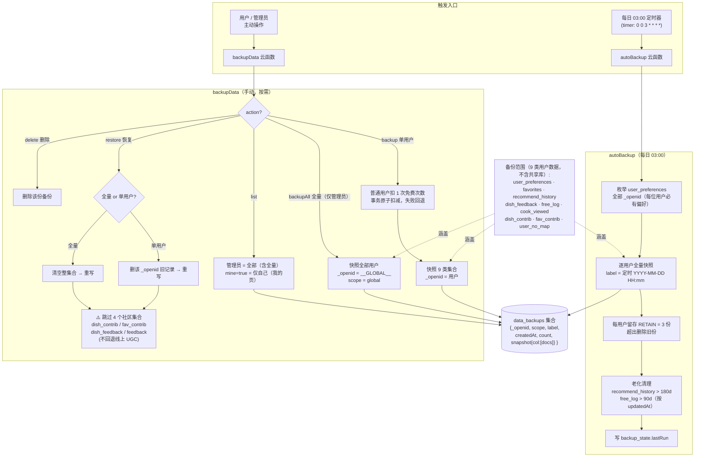

# 「诶呀妈呀 今天吃啥呀」备份机制流程图

## 关键说明

- **两条链路共享存储**：手动(`backupData`)与自动(`autoBackup`)的快照都写入 `data_backups`。
- **恢复隔离社区数据**：`restore` 永远跳过 `dish_contrib/fav_contrib/dish_feedback/feedback`，只恢复个人数据，避免覆盖线上 UGC。
- **防滥用 + 原子性**：普通用户手动备份扣 1 次免费次数，用事务保证"扣次 ↔ 备份"一致，失败自动回退。
- **自动备份无 `_updateTime`**：本环境文档无系统时间字段，故从 `user_preferences` 枚举用户做全量快照，而非增量。
- **定时器保护**：`autoBackup` 必须用 `createFunction(force + triggers)` 部署，否则 `updateFunctionCode` 会丢弃每日 03:00 触发器。
