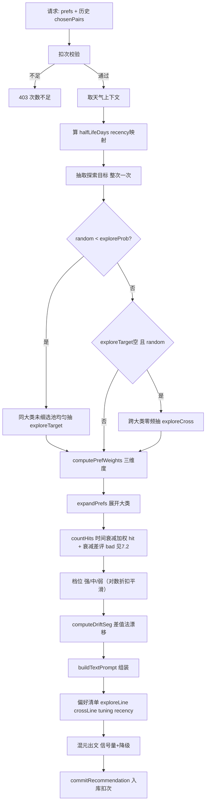
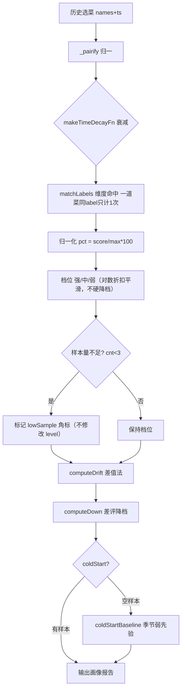
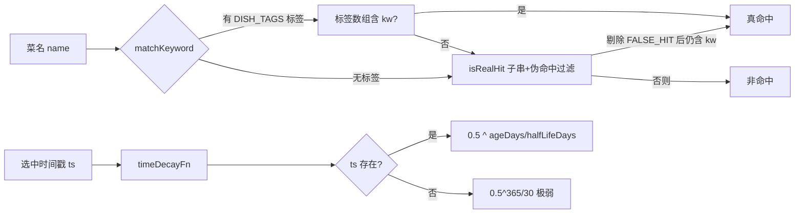

# 权重算法设计与说明

> 版本：2026-08-11 增量版（在 2026-08-10 收敛版基础上追加：① 中性反馈带 ts 时间衰减；② 跨场景 MMR 主蛋白质去重；③ 修复全局曝光降权读取端索引缺失使方案C真正生效；④ 营养软均衡增强）
> 适用范围：`getRecommendation`（出文侧，决定"推荐什么"）、`getWeightOverview`（画像侧，决定"画像报告展示什么"）以及共享模块 `utils/sync_weights.js`
> 设计目标：基于用户**真实选择时间序列**学习口味偏好，用可解释的权重/档位驱动推荐，同时避免信息茧房与子串误命中。

---

## 一、总体数据流

```
                        用户历史数据集（recommend_history / user_preferences）
                                       │
        ┌──────────────────────────────┴───────────────────────────────┐
        │                                                              │
   【出文侧 getRecommendation】                                  【画像侧 getWeightOverview】
   目的：生成一份"带偏好指令"的提示词                      目的：把历史统计成可读的口味画像报告
        │                                                              │
   ① 取偏好页显选 prefs.meat/veg/cuisine                      ① 取历史选菜名（含 ts）
   ② 取历史 chosenPairs（{name,ts}，近 40 道）                ② 走 computeFieldWeights 做维度统计
   ③ sync_weights 计算权重/档位/漂移                         ③ computeDrift 提取"常吃未勾选"方向
   ④ 探索-利用（E&E）注入探索目标                           ④ computeDown 提取差评降档方向
   ⑤ renderTuning 注入调校参数（含 recency 念旧/喜新）       ⑤ 冷启动 → coldStartBaseline 季节弱先验
   ⑥ 拼装提示词 → 混元出文                                  ⑥ 输出分维度 {label,score,level,pct,cnt,lowSample}
        │
   ⑦ commitRecommendation 入库扣次
```

两端**共用同一套口径**（DRIFT_MEAT、matchKeyword、时间衰减、伪命中过滤均来自 `sync_weights.js`），避免"推荐说你爱辣、画像报告说你清淡"的口径漂移。

---

## 二、共享层（`utils/sync_weights.js`）

这是两套算法的"真理之源"，纯 JS、不依赖云 SDK，被两个云函数各自目录内的副本 `require`。

### 2.1 子串伪命中过滤 `FALSE_HIT` / `isRealHit`

单字/短词（猪、牛、鱼、豆…）做 `indexOf` 匹配会被无关菜名误命中，导致权重系统性偏移：

- `鱼香肉丝` ≠ 鱼、`猪油渣` ≠ 猪、`牛奶` ≠ 牛、`鱼腥草` ≠ 鱼
- `FALSE_HIT` 表列出每个关键词的"伪命中词"；`isRealHit(s, kw)` 先把所有伪命中词剔除，剩余字符串里还能找到 `kw` 才算真命中。

### 2.2 标签优先匹配 `matchKeyword(name, kw, DISH_TAGS)`

解决"子串 vs 标签打架"：

1. 若 `DISH_TAGS[name]` 有结构化标签（`meat` / `veg` 数组），**优先看标签**是否含 `kw` → 命中即真命中，不再退回子串（避免二者互相打架）。
2. 标签未覆盖该小类（如"辣"）时，回退 `isRealHit` 子串 + 伪命中过滤作为补充。

> 例：`豆腐` 在 `DISH_TAGS` 里标了 `veg=豆制品`，`matchKeyword('麻婆豆腐','豆腐')` 直接从标签命中，不再被 `FALSE_HIT['豆']`（豆瓣酱、豆浆…）误杀。

### 2.3 时间衰减 `timeDecayFn` / `makeTimeDecayFn`（#1 优化核心）

**旧写法**：`0.96^i`（`i` = 序列位置），把"连吃一周后停三个月"和"每天一道"当成等间隔，衰减曲线失真。

**新写法**：按**真实时间间隔**衰减，半衰期 `HALF_LIFE_DAYS`：

```
decay = 0.5 ^ (ageDays / halfLifeDays)
ageDays = (now - 选中时间戳) / 86400000
```

- `ts=0`（无时间信息）按"最旧"保守处理 → `0.5^(365/30)` 极弱，避免无时间记录被当最新。
- `ts` 缺省时 `makeTimeDecayFn` 退化为 `0.96^i` 兜底，**老链路行为不变**。
- `halfLifeDays` 由 `tuning.recency` 驱动（见 §四），默认 30 天。

### 2.4 漂移差值法 `splitByRecency` / `computeDrift`（#3 优化核心）

旧写法：历史里某方向出现 ≥3 次且占比 >15% 即判漂移 → 会把"三个月前爱吃、现在早不吃了"的方向误判为当前漂移。

新写法：按真实时间戳把样本切成**近段（≤30天）** 与 **早段**，比较两者占比差：

```
近段占比 r = cntR[k] / totR
早段占比 e = cntE[k] / totE
判定上升漂移：cntR[k] >= 3 且 r > 0.15 且 (r - e) > 0.1
```

含义：不仅"近期常吃"，还要"比早段明显更多"，才是真正的口味上扬方向。

### 2.5 冷启动季节基线 `coldStartBaseline(season)`

无历史的新用户（画像侧 `sample` 为空），按当前季节给一组**弱先验**（最高 20，落在"弱"档），避免纯靠混元默认瞎推：

- 春：春笋、荠菜、河鲜…；夏：冬瓜、苦瓜、凉拌、清蒸…；秋：蟹、莲藕、栗子…；冬：萝卜、牛肉、火锅、炖…

### 2.6 中性反馈标量稀释 `extractNeutralTimed`（2026-08-10 接入 / 2026-08-11 升级带 ts 时间衰减）

`rateDish` 的中性反馈（"一般/无感"，`v===0`）本质是「用户整体无感倾向」的全局标量——它**不记菜名明细**（我们不知道用户对哪道菜无感，只知「他一共给了多少次无感」），故无法像 `softDislike` 那样映射到具体类目。

**采集格式（2026-08-11 升级）**：`rateDish` 每次中性反馈**同时**写入两处，兼容旧数据：
- `neutralCount`（`_.inc(1)`，整数计数，保留用于旧用户兼容读取）；
- `neutralEvents`（`_.push([{ts}])`，**仅带时间戳、不带菜名**的数组——同一菜多次给无感都算独立信号，不去重）。

**时间衰减加权（2026-08-11 新增）**：`extractNeutralTimed` 优先遍历 `neutralEvents`，用 `timeDecayFn(ts, now, 60)`（半衰期 60 天，比差评 15 天更长=弱信号慢消退）对每次无感事件加权求和，再压成 0~1 标量：

```
sum  = Σ timeDecayFn(e.ts, now, 60)        // 每次无感按时间衰减
neutralWeight = 1 - e^(-sum / SCALE)        // SCALE=8：约 8 次有效无感达 63%、16 次达 86%
```

- 回退兼容：无 `neutralEvents` 的旧用户（仅 `neutralCount`）按纯整数标量 `1-e^(-cnt/8)` 处理（不衰减，保持 2026-08-10 上线初行为）。
- **设计取舍（大白话）**：频繁给无感的用户，其单条好评更可能是偶然，不该被当真偏好。带 ts 衰减后，"三个月前频繁无感"与"上周刚频繁无感"可区分——近期无感权重大、久远无感缓慢消退，比旧版纯整数计数更准。
- **消费点**：`computePrefWeights` 的 `scoreOf` 对每个类目减去 `neutralScalar * NEUTRAL_WEIGHT`（`NEUTRAL_WEIGHT=3`，远小于差评的 10），详见 §3.1 与 §9.2。
- **语义边界**：中性稀释是「轻量防放大」，绝不压过真差评；与 `softDislike`（有明细、定向类目降权、系数 10）互补，互不冲突。

---

## 三、出文侧算法（`getRecommendation`）

### 3.1 偏好权重 `computePrefWeights`（meat / veg / cuisine）

输入：偏好页显选项 `p[field]` + 历史 `chosenPairs/chosenNames` + `halfLifeDays`。

**① 展开层级（解决"小类挤占大类"）**

`expandPrefs` 把用户勾选的**大类**展开成其下所有**小类**（如"猪肉"→ 五花肉/排骨/猪蹄…），同大类下未细选的小类作为 `unsel` 保底曝光。

**② 学习计数 `countHits`**

对 `probe = 展开小类 ∪ unsel`，遍历历史样本，用 `makeTimeDecayFn` 做**时间衰减加权**得到 `hit[w]`（学习信号分数，小数），**同时返回 `cnt[w]`（原始命中次数，整数）**。差评软信号 `bad[w]` 来自 `softDislike` 偶发差评（经 `extractDislikeTimed` 时间衰减，见 7.2）。
> ⚠️ `lvlOf` 的对数折扣 `bayesShrink(wRaw, cnt)` 的 `cnt` 必须传 `cnt[w]`（原始次数），**不可**传 `hit[w]`（小数衰减分数）——详见防回归要点 #4。

**③ 档位计算**

```
显选项：   score = max(40, 70 + min(30, hit*10) - bad*10 - neutral*3)   → 强 / 中 / 弱
未选小类： score = max(20, 30 + min(25, hit*10) - bad*10 - neutral*3)   → 弱 / 中
```
> `neutral` = `extractNeutralTimed(prefs,60).weight`（0~1 全局标量，已按中性事件 ts 时间衰减加权；无 `neutralEvents` 旧用户回退整数标量），`*3` 为轻度稀释系数（见 §2.6）。中性项对所有类目统一减分，仅防偶发好评过度放大，量级远小于差评 `bad*10`。

- 三档**全部可达**（旧实现 `[弱]` 恒不可达）。
- 负反馈下限：显选项 40（只降温不封杀明确偏好）、未选小类 20（#12 修复：避免差评未选项反而高于中性未选项）。
- 样本量不足时，`lvlOf` 内部自动应用对数折扣（`bayesShrink`，见 7.3）进行平滑，无需显式降档。
- 输出形如：`猪肉[强]`、`牛肉[中]`、`豆腐[弱]`，直接进提示词作为硬/软偏好指令。

> `lvlOf` 返回的档位已包含对数折扣平滑，不再额外硬降档（与 7.3、4.1 口径完全一致）。

**④ 口味漂移 `computeDriftSeg`**

用 `DRIFT_MEAT`（8 大类：猪肉/牛肉/羊肉/鸡肉/鸭肉/鱼虾海鲜/蛋类/素菜豆制品）对历史统计，**仅 meat/veg 维度**，cuisine 维度漂移置空（菜系已通过 `p.cuisine` 硬约束，不应再被弱标）。

输出："你近期常吃但未在偏好勾选的方向偏向 X、Y，可适度靠拢"——且**已显选方向剔除**（coveredDrift 只含偏好页显选项，不含自动学习漂移，否则"自己学会的方向自己屏蔽自己"）。

### 3.2 探索-利用 E&E（#4 优化核心，防信息茧房）

每次请求**只抽一次**探索目标（避免分块各抽导致概率被放大）：

```
exploreProb ← 默认由 B① 自学习探索率驱动（见 §7.2）；
             仅当 tuning.explore < 20（用户显式压低探索）时才改回旋钮分段：
             <20→5% / 20-39→20% / 40-59→30% / 60-79→50% / 80-89→70% / ≥90→85%

① 同大类未细选探索（exploreTarget）
   若 random < exploreProb：从「用户已选大类下的未细选小类完整池」均匀随机抽 1 个（避开忌口/拉黑/差评）
   → 注入硬性指令：「至少 1 道菜使用 X」（受忌口约束，冲突则忽略）
   方向选取：B② 开关开启且单臂达标 → Thompson 采样；否则 UCB 上界优先（见 §7.3）

② 跨大类新方向探索（exploreCross，仅当 ① 未命中时）
   若 random < exploreProb*0.5：从「用户零频大类」(prefs 完全没选过的大类) 抽 1 个
   → 注入：「至少 1 道菜尝试新方向 Y」（真正打破信息茧房）
   方向选取：与 ① 同源（Thompson / UCB）
```

> 两条探索互斥（不叠加塞两个目标挤占少量菜品）；命中的探索目标通过 `buildTextPrompt` 的 `exploreLine`/`crossLine` 以**可执行硬性要求**下达，而非让 AI 自己把握"30% 比例"这种它算不准的百分比。

**探索计数维护（`dish_exposure`，2026-08-08 修复）**：每个探索方向（`EXPLORE::<方向>`）文档含 `cnt`（被推次数）与 `accept`（采纳次数）两字段。
- `bumpExplorePush(db, dirs)`：探索方向**被抽中出文**时 `cnt+1`（fire-and-forget，与 `bumpExposure` 并列调用）。
- `bumpExploreAccept(db, dirs)`：用户**采纳**该探索方向时 `accept+1`。
- ⚠️ 修复前架构只回写 `accept`、从不写 `cnt`，导致 UCB 的 `cnt` 恒为 0（永远走首推近似随机），且 B② 进度（要求 `cnt>=minTotal`）恒为 0/0。本次补齐后 UCB 真实生效、B② 进度可观测。历史 0 数据不回溯，随真实出文积累。

### 3.3 出文侧主流程（文字生成）

```
1. 扣次校验（免费次数不足 → 403）
2. 取真实天气上下文（C 方案：定位/城市/兜底节气）
3. 计算 halfLifeDays（来自 tuning.recency）
4. 抽取 exploreTarget / exploreCross（整次一次）
5. 按场景切片并发生成提示词（buildTextPrompt）
   ├─ 偏好权重清单（computePrefWeights 的 [强]/[中]/[弱]，对数折扣平滑）
   ├─ 口味漂移参考（computeDriftSeg）
   ├─ tuning 调校（renderTuning：explore/tasteShift/health/seasonal/serving/recency…）
   ├─ 探索硬性指令（exploreLine / crossLine）
   └─ cuisineTasteShift 产出的菜系软化指令（仅当检测到「显选菜系」与「近30天实际高频菜系」冲突占比≥40% 时，注入少数菜品放宽硬约束；不写回 prefs）
6. 本地信号量 + 云端 withTextSlot 防并发雪崩
   └─ 主模型 hy3 失败/满 → 由 aiGateway 兜底 custom/[SF]（hy3-preview 已于 2026-08-27 移除，仅 hy3 单通道，限流退避重试 1 次不放大 429）
7. commitRecommendation 入库阶梯扣次（前 2 场景各 1，第 3 起各 2）
```

---

## 四、画像侧算法（`getWeightOverview`）

目的：把用户历史选菜统计成**可读的口味画像报告**（前端"我的口味画像"）。

### 4.1 维度统计 `computeFieldWeights`

对 `names`（支持 `string[]` 或 `{name,ts}[]`）：

1. `_pairify` 归一为 `{name,ts}`
2. `makeTimeDecayFn(now)`（半衰期 30 天，画像侧走默认，不接 recency）做衰减
3. `matchLabels` 按维度表（MEAT / VEG / FLAVOR_*）统计命中，一道菜对同一 label 只计一次
4. 归一化：`pct = round(score / max * 100)`（相对用户自身最大值，避免绝对量误导）
5. 档位：`pct>=70 强 / >=45 中 / 否则弱`
6. **样本量标记（#8 / 2026-08-06 优化#5）**：`cnt<3` 仅标 `lowSample`（前端「数据较少，仅供参考」角标），**不再修改 `level`**。画像侧与出文侧归一化逻辑完全对齐，杜绝两端口径漂移（详见 7.3）。

输出：`[{label, score, level, pct, cnt, lowSample, samples}]`，按 score 降序。

### 4.2 漂移 / 降档 / 冷启动

- `computeDrift`：同 §2.4 差值法，提取"常吃但未勾选"方向（≥3 次 & 占比>15% & 近段−早段>0.1）。
- `computeDown`：softDislike 命中标签 → 降档方向。
- 空样本 → 返回 `coldStart:true` + `coldStartBaseline(currentSeason())` 季节弱先验。

---

## 五、tuning 调校旋钮

`DEFAULT_TUNING` 含以下项（前端 `pages/tuning` 可调，后端 `renderTuning` 注入提示词；`recency` 额外驱动衰减半衰期）：

| 旋钮 | 范围 | 作用 |
|------|------|------|
| `explore` | 0-100 | 探索概率（映射见 §3.2） |
| `tasteShift` | 0-100 | 口味微调倾向 |
| `health` | 0-100 | 健康度偏好 |
| `complexity` | 0-100 | 烹饪复杂度 |
| `repeatGuard` | 0-100 | 重复度抑制 |
| `surprise` | 0-100 | 惊喜度（尝鲜跳脱程度） |
| `nutrition` | none/muscle/fatloss/lowsugar | 营养目标 |
| `seasonal` | bool | 应季时令优先 |
| `serving` | solo/multi | 一人食/多人餐 |
| **`recency`** | **0-100** | **念旧↔喜新：`halfLifeDays = 10 + (recency/100)*40`；0→10天(最喜新)、50→30天(默认)、100→50天(最念旧)** |

---

## 六、防回归要点（维护者必读）

1. **副本铁律**：改 `utils/sync_weights.js` 后，必须复制到 `cloudfunctions/getRecommendation/sync_weights.js` 与 `cloudfunctions/getWeightOverview/sync_weights.js` 再部署，否则云端用旧副本。
2. **时间衰减禁止改回 `0.96^i` 位置写法**——必须按真实时间间隔（`makeTimeDecayFn`）。
3. **漂移禁止改回"原始命中≥3 占比>15%"单一阈值**——必须近段/早段差值法（`splitByRecency`）。
4. **`cnt` 必须取「原始次数」**：`countHits` **同时返回 `{hit, cnt}`**（`hit`=衰减加权分数，`cnt`=原始命中次数）。`lvlOf` 调 `bayesShrink(wRaw, cnt)` 时**必须传 `rawCnt[k]`（原始次数）**，**绝不能**传 `hit[k]`（小数衰减分数）——否则对数折扣按小数计算、折扣过重且量纲错误（曾因误传 `hit[k]` 导致平滑失效，已修）。`computePrefWeights` 须 `const {hit, cnt: rawCnt} = countHits(...)` 同时解构。
5. **探索目标整次只抽一次**，不可在分块内各抽（概率会被放大）。
6. **`computeDriftSeg` 的 coveredDrift 只含偏好页显选项**，不含自动学习漂移（否则自动漂移方向自我屏蔽，drift 段失效）。
7. **冷启动**：画像侧空样本返回季节基线；出文侧无历史时退化到默认 decay 兜底，不影响主链路。
8. **中性反馈稀释（2026-08-10 接入 / 2026-08-11 升级带 ts 时间衰减）**：`computePrefWeights` 的 `scoreOf` 末尾减 `neutralScalar * NEUTRAL_WEIGHT`，`NEUTRAL_WEIGHT` 必须远小于差评系数（取 3，差评为 10）——中性信号是「全局轻度稀释、防偶发好评过度放大」，**绝不能**与 `bad`（定向类目降权、系数 10）等价或反超，否则会压过真差评。中性标量来自 `extractNeutralTimed(prefs,60)`（已按 `neutralEvents` ts 时间衰减加权；无 `neutralEvents` 旧用户回退 `neutralCount` 整数标量）。改动 `sync_weights.js` 后须同步 5 处副本 + utils 并跑 `check_sync_weights.js`（见 §9.4）。
9. **跨场景 MMR 去重（2026-08-11）**：`mmrRerank` 的跨场景参数 `crossState` 必须在 `recommendations.forEach` **前**初始化并全程共享引用（在 forEach 内每个 group 累积 `cross.proteins`），使早→午→晚多场景出文的主蛋白质跨场景去重。`CROSS_PROTEIN_PENALTY=0.3` 须**小于**同场景内 `PROTEIN_PENALTY=0.5`（跨场景只温和降权、不压死到没菜可选）；仅惩罚主蛋白质、不惩罚标签。改动后 bump `getRecommendation` BUILD_TAG 并 `invokeFunction` 直读日志确认生效（见 §7.7 / §9.5）。

---

## 七、二次优化（2026-08-06，生产环境长期运行视角）

> 在「历史统计失真」问题已解决的基础上，针对 7 个工程评审点落地 5 项低风险优化（#3 硬去重已存在、#4 出文侧未用冷启动基线，跳过）。

### 7.1 探索失败短期黑名单（优化#1，E&E 反馈闭环）
- **问题**：`exploreTarget`/`exploreCross` 从「未选小类/零频大类」均匀随机抽，抽到用户讨厌的方向（如不爱内脏却抽到猪肝）会被差评但**下次仍可能再抽**，反复骚扰。
- **解法**：`sync_weights.explorePenalty(prefs, now)` **实时扫描** `prefs.softDislike`，把 `ageDays < 7` 的差评菜经 `matchDriftLabels` 映射到 DRIFT_MEAT 大类 label，动态加入「被封禁探索池」。
  - **TTL 存储位置（关键，避免误实现）**：**不依赖云函数内存缓存**（实例冷启动/销毁会丢失封禁记录，导致下一轮又抽到讨厌方向）。直接复用 7.2 已升级的**带时间戳差评数据**（`softDislike` 每项 `{dish, ts}`），`explorePenalty` 每次请求实时计算 `base - ts > 7天` 即解封。天然跨实例、持久化、精确到秒；差评超 7 天自动从封禁池消失，符合 TTL 语义。
  - 出文侧 `buildTextPrompt` 前构建 `exploreBanned`，`exploreTarget` 的 `usable` 过滤（小类→label 经 `matchDriftLabels` 反查）与 `exploreCross` 的 `crossPool` 过滤均剔除被封禁大类。
  - 仅封禁「探索方向」，不影响正常的偏好命中与硬约束。

### 7.2 差评时间衰减（优化#2，防永久霸凌权重）
> （`rateDish` 为评价云函数，不在本文档适用范围，但其差评数据格式与本算法共享同一 `softDislike` 存储，故在此说明其写入格式变化。）

- **问题**：`score = 70 + hit*10 - bad*10` 中 `bad` 不衰减，3 个月前偶发差评会永久压权（差值 -10 足以降档）。
- **解法**：
  - `rateDish` 的差评写入由纯字符串 `dish` 升级为 `{dish, ts}` 对象数组（兼容旧纯字符串数组，经 `extractDislikeNames` 读取）。
  - `computePrefWeights` 的 `bad` 改用 `extractDislikeTimed(..., halfLifeDays=15)`——**半衰期 15 天，比正向（30 天）更短**，符合"差评遗忘更快"的现实。负向半衰期设为正向的 1/2（15 天 vs 30 天），基于"一次差评的负面影响应比一次好评更快消退"的假设：用户临时口味波动（如"今天不想吃辣"）应比稳定偏好更快被遗忘，否则差评会长期压住对真实偏好的学习速度。若未来数据证明该假设不成立，可独立调优，但不建议与正向半衰期相等（否则差评将永久性压制偏好学习）。
  - **旧数据兼容**：`extractDislikeTimed` 对纯字符串差评（旧格式，无 ts）按 `ts=Date.now()` 视为近期全权重——既不丢失旧差评，也不会永久霸凌（新带时间戳的差评会逐渐稀释它）。`_asDish` 对该情形显式走全权重分支，而非 `ts=0`（极弱）分支。
  - 画像侧 `getWeightOverview.computeDown` 同步改用 `extractDislikeTimed` 衰减口径，保证两云函数降档方向一致。

### 7.3 对数折扣替代 cnt<3 硬降档（优化#5，置信度细粒度平滑）
- **问题**：`cnt<3` 整体降一档，会阉割「2 次强信号」（如新用户连点 2 天麻辣香锅）；且原贝叶斯实现 `prior` 取「用户自身均值」，纯新用户 `prior=0` 收缩失效，与硬降档无区别（量纲也不同：wRaw 是分数、cnt 是次数）。
- **解法**：取消硬降档，改用**对数折扣**——`bayesShrink(wRaw, cnt, prior, K=3) = wRaw * cnt/(cnt+K)`（此处 `cnt` 是 `countHits` 返回的**原始命中次数 `rawCnt`**，非衰减分数 `hit`，详见防回归 #4）：
  - `cnt=0` → 0（无数据不强行赋先验，避免新用户被错误赋强偏好）
  - `cnt=2` → `wRaw*0.4`（保留 40% 强信号，不再被砍档）
  - `cnt` 大 → 趋近 `wRaw`（命中主导，无过拟合）
  - 量纲统一为分数，数学透明，**无需维护全局大盘先验**（也规避了「先验从哪来」的歧义）。
- **两端一致**：出文侧 `computePrefWeights.lvlOf` 与画像侧 `computeFieldWeights` 均**不硬降档**（画像侧仅留 `lowSample` 标记）。同一用户两端口径完全对齐。
- **`K=3` 取值依据**：`K` 决定"多少次命中算置信"。取 1 惩罚过轻（2 次命中即近乎全权重，与硬降档初衷相悖）；取 10 则新用户 10 次内都被严重压制，学习过慢。取 3 符合经验法则——3 次命中已能提供基础置信度（"事不过三"的统计直觉），且 `cnt=2→0.4`、`cnt=3→0.5` 的折扣斜率对早期样本温和。若未来数据量显著增大，可通过 A/B 测试调优，但当前无需改动。

### 7.3b 中性反馈接入权重算法（2026-08-10 接入 / 2026-08-11 升级带 ts 时间衰减）
> 背景：用户早期提出"把 ② neutralCount 接进权重算法"。此前 `rateDish` 仅采集 `neutralCount`、算法侧未消费；2026-08-10 落地消费侧（纯整数标量），2026-08-11 升级为带 ts 时间衰减（更准）。

- **问题**：一个用户给某菜点过 1 次好评（`dishLikes`）就被当「强偏好」；但若该用户其实频繁对推荐给"无感"，那次好评很可能是偶然，不该被放大成强偏好。
- **采集格式（2026-08-11 升级）**：`rateDish` 中性分支（v===0）由 `neutralCount: _.inc(1)` 升级为**同时**写入 `neutralEvents: _.push([{ts}])`（仅带时间戳、不带菜名，保持全局标量语义；不去重，同菜多次无感都是独立信号），保留 `neutralCount` 兼容旧数据。
- **算法（见 §2.6）**：`extractNeutralTimed(prefs,60)` 优先遍历 `neutralEvents`，用 `timeDecayFn(ts, now, 60)`（半衰期 60 天，比差评 15 天更长=弱信号慢消退）加权求和 → `1-e^(-sum/8)` 压成 0~1 标量；无 `neutralEvents` 旧用户回退 `neutralCount` 整数标量（不衰减，保持上线初行为）。作为**全局轻度稀释**作用于 `computePrefWeights` 所有类目分数：`scoreOf` 末尾减 `neutralScalar * NEUTRAL_WEIGHT`（`NEUTRAL_WEIGHT=3`，远小于差评 10）。
- **与 softDislike 分工**：`softDislike` = 明确「这方向我不喜欢」（有明细、定向类目降权、系数 10）；`neutral` = 模糊「我对推荐整体无感」（无明细、全局稀释、系数 3，仅防好评过度放大）。二者互补，互不冲突。
- **改动落地（2026-08-11）**：`SYNC_WEIGHTS_VERSION` bump 到 `2026-08-11.neutral-events-ts`，主副本同步复制到 5 处（utils + getRecommendation / getWeightOverview / computeBaseline / commitRecommendation），`scripts/check_sync_weights.js` 哈希+版本+HIER 全绿；`rateDish` BUILD_TAG=`2026-08-11.neutral-events-ts`、`getRecommendation` BUILD_TAG=`2026-08-11.neutral-events-ts`，MCP 部署后 `invokeFunction` 直读日志确认新容器生效。
- **铁律印证**：首次 `updateFunctionCode` 返回 success 后 `invokeFunction` 仍回读旧 BUILD_TAG（SCF 旧容器续活），隔一轮重 invoke 后确认新版本生效——再次确认"MCP 返回 success ≠ 线上生效，必须以 invokeFunction 直读 BUILD_TAG 为准"。

### 7.7 跨场景 MMR 主蛋白质去重（2026-08-11，A 项，真实数据驱动）
> 背景：联网调研 2025-2026 推荐系统热点后逐条核对代码，发现清单里 80% 已落地（MMR / analyzeRepeat / 时间上下文 / E&E / 全局曝光降权 / 菜系漂移均已实现）。唯一真实盲点是「MMR 只在单场景内做、跨场景（早→午→晚）漏掉」，经读 `recommend_history` 真实数据（112 条，多场景出文常态）证实：午晚同名同菜（糖醋里脊×2、鱼×1）+ 猪肉系多次跨场景撞车。

- **问题**：`mmrRerank`（见 §九 9.5）原本对每个场景 group `recommendations.forEach(g => ...)` **独立**做 MMR 去重，保证单场景内不撞车；但用户一次出「早+午+晚」多场景时，全天可能都推同一主蛋白质（如全天猪肉系），跨场景无硬约束（`analyzeRepeat` 是长期软治理，不挡单次多场景出文）。
- **解法**：`mmrRerank(recommendations, DISH_TAGS, crossState)` 新增**跨场景累积参数** `crossState = {proteins:[], tags:[]}`（调用方在 `recommendations.forEach` 前初始化、全程共享引用）：
  - 每个场景入选菜的主蛋白质 push 进 `cross.proteins`，供**后续场景**候选参考；
  - 候选主蛋白质若已在 `cross.proteins`（先前场景已选过），加温和惩罚 `CROSS_PROTEIN_PENALTY = 0.3`（**小于同场景内 `PROTEIN_PENALTY=0.5`**），使全天主蛋白质更分散，但**不压死到没菜可选**；
  - 仅惩罚主蛋白质、不惩罚标签（标签跨场景重复不严重）；单道菜场景也把主蛋白质计入跨场景池。
- **落地**：`getRecommendation/index.js` 调用点（方向2 重排处）创建 `const crossMmrState = { proteins: [], tags: [] }` 并传入 `mmrRerank`。BUILD_TAG=`2026-08-11.cross-scene-mmr`，MCP 部署后 `invokeFunction` 直读日志确认新容器生效（coldstart=true）。纯算法内部、零前端改动、不改 `sync_weights`、无需发版。
- **B 项（疲劳度软衰减）暂缓**：`analyzeRepeat` 的 tired 分档基于用户 own 历史，当前 `_openid` 仅 4 个含管理员测试账号刷量、不具统计代表性。按铁律"改公式须拿真实数据实测分布"，等样本量 ≥500（persona_baseline TGI 置信门槛）再做实测决策。

### 7.8 营养软均衡（2026-08-11，① 项，增强）
> 背景：联网调研 2025-2026 推荐系统热点「营养均衡 / 膳食多样性」核对代码，发现当前 MMR 管「不撞车」但不管「不偏食」——若某场景候选全是荤菜（无素），菜单荤素失衡。`DISH_TAGS` 每菜含 `meat[]`（荤料）、`veg[]`（蔬菜/素料），具备做轻量营养均衡的基础。

- **问题**：用户一次出文若某场景（如「午餐」）候选恰好是 [红烧肉, 糖醋里脊, 宫保鸡丁] 全荤，AI 不会自动补素，长期偏食且不符合健康推荐直觉。
- **解法**：两层软约束，互不破坏已有逻辑——
  1. **机器硬补救 `nutrientBalanceBoost(recommendations, DISH_TAGS)`**：紧跟 `mmrRerank` 之后调用。遍历每个场景 dishes，若**全荤无素**（无 `isVegDish` 候选）则把已有素菜候选前置（仅"有素则前置"，不重排荤菜内部顺序、不引入候选池外菜品，避免破坏 MMR 已定多样性）；若场景本就含素菜则不干预。
  2. **提示词软建议 `renderNutriSeg(recommendations, DISH_TAGS)`**：基于各场景荤素分布，对「全荤无素」场景生成软约束句（如「宜搭配一道青菜或豆制品类素菜」），注入 `buildTextPrompt` 的 `nutriSeg` 段（位于 `personaSeg` 之后、`driftSeg` 之前）。明确标注「仅为搭配建议，不强制替换已确定菜品，若场景本就不适合素菜可忽略」——**不改 AI 已确定输出**，仅作软参考。
- **判定函数**：`isVegDish(name)` = `DISH_TAGS[name].veg` 非空 且 `meat` 为空；`isMeatDish(name)` = `meat` 非空。
- **设计取舍**：轻量版，不引入营养评分模型（热量/蛋白克数），仅用已有的荤素标签做「不偏食」兜底；与 MMR 互补（MMR=不撞车，本函数=不偏食）。后续若上营养 KB 可升级为热量/蛋白硬约束。
- **调用点**：`nutrientBalanceBoost` 在 `mmrRerank` 后调用；`renderNutriSeg(recommendations, DISH_TAGS)` 作为 `buildTextPrompt` 末参传入（见 §九 9.5 代码节）。
- **验证**：BUILD_TAG=`2026-08-11.exposure-noindex-fix+nutrient-balance`，SCF 旧容器续活已按铁律隔轮重验生效。

### 7.3b 全局曝光降权根因修复（2026-08-11，③ 项，让方案 C 真正生效）
> 背景：排查 `dish_exposure` 集合 Count=0 发现——方案 C（全局高频曝光软降权）早已写好代码（`getGlobalExposureTop` + `bumpExposure` + `buildTextPrompt` 注入），但**从未实际生效**。根因是 **NoSQL 查询 `orderBy('cnt','desc')` 在 `dish_exposure` 集合无 `cnt` 索引时会整体失败**（报错被 `getGlobalExposureTop` 的 catch 降级为空），导致方案 C 永远读不到数据、软降权名存实亡；同时早期 `dish_exposure` 集合未被显式创建（`bumpExposure` 的 `.add()` 在集合不存在时静默失败，曝光计数从未写入）。

- **修复1（读取端，核心）**：`getGlobalExposureTop` 去掉 `orderBy('cnt','desc')`，改为 `.limit(1000)` 拉**全量**后在 JS 内存里 `sort` + 时间衰减过滤。彻底绕开索引缺失问题——无论集合有无索引都能正确读取。`.catch` 保留作最后兜底。
- **修复2（写入端，前置条件）**：确认 `dish_exposure` 集合已存在（通过 `CreateIndex`/云端查询确认 IndexCount=2 系统默认索引，集合已建）。`bumpExposure` 的 `update→add` 逻辑不变，集合存在后下次真实出文自然写入，方案 C 开始积累数据。
- **遗留**：`cnt` 自定义索引此前 `CreateCollectionIndex` Action 不存在、`CreateIndex` 未明确返回成功，**未强制建**——但修复1已让读取不依赖索引，故不影响功能。若后续数据量大（>1000 条），可在 NoSQL 控制台手动建 `cnt` 降序索引优化查询性能（当前 limit(1000) 足够）。
- **验证**：BUILD_TAG=`2026-08-11.exposure-noindex-fix+nutrient-balance`，invokeFunction 直读 `[build]` 行确认新容器生效（coldstart=true）。`dish_exposure` 需在真机出文一次后开始积累数据（可在 NoSQL 控制台观察 Count 从 0 增长）。

### 7.4 副本同步校验脚本 + 运行时版本日志（优化#6，消灭人为风险）
- **问题**：`sync_weights.js` 三处副本靠人工复制，遗漏即导致「推荐说爱 A，画像说爱 B」；且开发者可能改完直接部署、忘记跑校验脚本。
- **解法（双保险）**：
  1. **版本号常量单一真相源**：`sync_weights.js` 顶部 `SYNC_WEIGHTS_VERSION`，每次改动逻辑后**必须 bump 并同步复制副本**。`scripts/check_sync_weights.js` 升级为**哈希 + 版本号双重校验**——即使复制了旧文件但忘了 bump 版本，脚本也能捕获。已验证三处哈希 + 版本号均一致（2026-08-06.2）。
  2. **运行时日志（方案A轻量版）**：两云函数 `index.js` 顶部 `console.log('[sync_weights] <函数名> version=' + SYNC_WEIGHTS_VERSION)`。线上日志可对比两函数版本号，若不一致即副本未同步，触发人工复查（不阻塞服务，避免线上宕机）。
  - **未采用** `file:` 私有包/软链——因为 `updateFunctionCode` 只打包目录、不跑 `npm install`，私有包会被部署忽略；npm `predeploy` 钩子也因无 package.json（走 tcb CLI）不可用。强制校验 + 版本号比改包结构更可靠。
  - 流程：改 `sync_weights.js` → bump `SYNC_WEIGHTS_VERSION` → 复制副本 → 跑脚本确认一致 → 部署。

### 7.5 cuisine 漂移软化（优化#7，硬约束-行为矛盾反向利用）
- **问题**：`p.cuisine`（显选菜系）与历史实际高频菜系冲突时，原实现把 cuisine drift 静默置空，硬约束与行为矛盾无缓解。
- **解法**：`cuisineTasteShift(prefs, sample, DISH_TAGS)` 检测近 30 天实际高频菜系 Top，若既非用户显选、又占近段 ≥40%，产出 `tasteShift` 文本注入提示词——**仅在少数菜品上适度放宽菜系硬约束**，允许少量该风格，软化"硬约束崩坏"风险。**不写回 prefs**，仅当次提示。

### 7.6 未改动项（评审已确认跳过）
- **#3 硬去重**：`repeatAvoid` 近 N 天已点菜禁出名单已通过 `buildTextPrompt` 注入，属硬约束非纯提示词，无需再改。
- **#4 天气联动冷启动**：`coldStartBaseline` 出文侧未调用（仅画像侧空样本用），天气已进 `renderTimeContext` 提示词；投入产出比低，跳过。

---

## 八、关键流程 Mermaid 图

### 8.1 出文侧权重 + 探索主流程



### 8.2 画像侧统计流程



### 8.3 共享匹配与衰减核心



---

## 九、附录：主体代码清单（设计与实现对照）

> 本节列出算法对应的**核心实现代码**，供维护者对照正文口径核验。
> 真理之源为 `utils/sync_weights.js`（纯 JS，被 `getRecommendation`/`getWeightOverview` 两云函数目录内的副本 `require`）。
> ⚠️ 部署前必须将 `utils/sync_weights.js` 复制到 `cloudfunctions/getRecommendation/sync_weights.js` 与 `cloudfunctions/getWeightOverview/sync_weights.js`，并 bump `SYNC_WEIGHTS_VERSION` 后跑 `scripts/check_sync_weights.js` 校验（详见 §7.4）。

### 9.1 共享层核心（`sync_weights.js`）

```javascript
// 版本号（改逻辑后必须 bump，并同步复制副本）
const SYNC_WEIGHTS_VERSION = '2026-08-10.neutral-dilute';

// 真实时间间隔衰减：halfLifeDays 半衰期（默认 30 天）
function timeDecayFn(ts, now, halfLifeDays) {
  const HALF_LIFE_DAYS = (typeof halfLifeDays === 'number' && halfLifeDays > 0) ? halfLifeDays : 30;
  const t = _asTs(ts);
  const base = now || Date.now();
  if (!t) return Math.pow(0.5, 365 / HALF_LIFE_DAYS); // 无时间 → 极弱
  const ageDays = Math.max(0, (base - t) / 86400000);
  return Math.pow(0.5, ageDays / HALF_LIFE_DAYS);
}

// 对数折扣（优化#5：替代 cnt<3 硬降档），K=3（"事不过三"经验法则）
function bayesShrink(wRaw, cnt, prior, K) {
  const c = (typeof cnt === 'number' && cnt > 0) ? cnt : 0;
  const k = (typeof K === 'number' && K > 0) ? K : 3;
  const w = (typeof wRaw === 'number') ? wRaw : 0;
  if (c === 0) return 0; // 无数据返回 0（cnt=0 时 wRaw 预期也为 0，未命中项无分数）
  return w * (c / (c + k));
}

// 差评时间衰减（优化#2）：softDislike 为 {dish, ts} 数组，半衰期 15 天（比正向更短）
function extractDislikeTimed(prefs, probe, field, DISH_TAGS, now, halfLifeDays) {
  const arr = (prefs && Array.isArray(prefs.softDislike)) ? prefs.softDislike : [];
  const base = now || Date.now();
  const hl = (typeof halfLifeDays === 'number' && halfLifeDays > 0) ? halfLifeDays : 15;
  const dec = {};
  arr.forEach(x => {
    const d = _asDish(x);
    if (!d || !d.dish) return;
    const w = (d.ts) ? timeDecayFn(d.ts, base, hl) : timeDecayFn(Date.now(), base, hl);
    // 旧纯字符串差评（ts=0）走「近期全权重」分支，被新带时间戳差评逐渐稀释
    let labels = [];
    if (field === 'cuisine') {
      labels = (DISH_TAGS[d.dish] && DISH_TAGS[d.dish].cuisine) || [];
    } else if (DISH_TAGS[d.dish]) {
      labels = (DISH_TAGS[d.dish].meat || []).concat(DISH_TAGS[d.dish].veg || []);
    }
    if (!labels.length) (probe || []).forEach(kw => { if (matchKeyword(d.dish, kw, DISH_TAGS)) labels.push(kw); });
    labels.forEach(l => { dec[l] = (dec[l] || 0) + w; });
  });
  return dec;
}

// 中性反馈标量稀释（2026-08-10 接入 / 2026-08-11 升级带 ts 时间衰减）：
// rateDish 中性反馈（v===0）现写入 neutralEvents[{ts}]（仅带时间戳、不带菜名）+ 兼容保留 neutralCount 整数。
// 优先遍历 neutralEvents 按 60 天半衰期 timeDecayFn 加权求和 → 1-e^(-sum/SCALE) 压成 0~1 标量；
// 无 neutralEvents 旧用户回退 neutralCount 整数标量（不衰减，保持上线初行为）。
const NEUTRAL_SCALE = 8;
function extractNeutralTimed(prefs, halfLifeDays) {
  const hl = (typeof halfLifeDays === 'number' && halfLifeDays > 0) ? halfLifeDays : 60;
  const now = Date.now();
  const events = (prefs && Array.isArray(prefs.neutralEvents)) ? prefs.neutralEvents : [];
  if (events.length) {
    let sum = 0;
    events.forEach(e => {
      const t = _asTs(e && e.ts);
      sum += t ? timeDecayFn(t, now, hl) : 1; // 无 ts 事件（理论不发生）按近期全权重
    });
    const weight = 1 - Math.exp(-sum / NEUTRAL_SCALE);
    return { weight: Math.max(0, Math.min(1, weight)) };
  }
  // 回退：兼容无 neutralEvents 旧用户（neutralCount 仍是整数标量，不衰减）
  const cnt = (prefs && typeof prefs.neutralCount === 'number') ? prefs.neutralCount : 0;
  if (cnt <= 0) return { weight: 0 };
  const weight = 1 - Math.exp(-cnt / NEUTRAL_SCALE);
  return { weight: Math.max(0, Math.min(1, weight)) };
}

// 探索失败短期黑名单（优化#1）：实时扫描 softDislike，TTL=7 天，不依赖内存缓存
const EXPLORE_PENALTY_TTL_DAYS = 7;
function explorePenalty(prefs, now) {
  const arr = (prefs && Array.isArray(prefs.softDislike)) ? prefs.softDislike : [];
  const base = now || Date.now();
  const ttl = EXPLORE_PENALTY_TTL_DAYS * 86400000;
  const banned = new Set();
  arr.forEach(x => {
    const d = _asDish(x);
    if (!d || !d.dish) return;
    const ts = d.ts || Date.now(); // 无 ts 旧差评按当前时间视为近期全权重（与 7.2 extractDislikeTimed 旧数据兼容一致）
    if (base - ts > ttl) return; // 超 TTL 解封
    matchDriftLabels(d.dish, null).forEach(l => banned.add(l));
  });
  return banned;

---

## 七、自学习权重算法（A① / B① / B②，2026-08-08 上线）

三个模块相互独立、各自带门控，默认均不生效（A① 由样本量门控、B① 由旋钮显式关闭时旁路、B② 由后台开关门控），避免小样本/冷启动数据失真时算法乱漂或自动上线。

### 7.1 A① 权重偏移门控 `weightBias`（软微调档位）

目的：用用户**近 90 天实际选择/差评**对偏好权重做小幅软修正，而非硬改档位。

- 触发：`computeWeightBias(db, OPENID, prefs, chosenPairs, DISH_TAGS)`，每次出文成功后 fire-and-forget 异步回灌，异常静默、绝不阻塞主链路。
- 参与维度：仅 `meat / veg / spicy` 三维度（`cuisine` 走硬约束，与 drift 口径一致，不进 bias）。
- 计算：
  - 取近 90 天有效选择 `chosenPairs`（最多 80 条）；
  - 用 `DISH_TAGS` 反向映射每道菜所属维度，统计该维度 `pos`（未差评选择）与 `neg`（被 softDislike 差评）；
  - 净向 `net = (pos-neg)/(pos+neg+1)`，偏移 `bias[f] = tanh(net * K) * 1.7`，夹紧到 `[-0.5, +0.5]`（`K=0.3`，故净向 ±1 时约 ±0.29→×1.7≈±0.5）。
- **门控**：近 90 天有效选择数 `< MIN_CHOICES(10)` → 清空 `weightBias`（`db.command.remove()`）退回原算法；某维度无样本则不动。
- 消费：`computePrefWeights` 里 `biasMap` 读取 `weightBias[f]`，在档位基础上做小幅软微调（见 §3.1 第 852 行附近）。

### 7.2 B① 自学习探索率 `exploreProb`

目的：探索概率随用户**探索采纳率**自适应，高采纳→更敢探索，总被跳过→收敛到最低 `0.05`，替代原写死的旋钮分段。

- 旧实现：`exploreProb` 完全由 `tuning.explore` 分段写死（0.05~0.85），与用户反应无关。
- 新实现：读该用户全部 `EXPLORE::*` 方向统计，算探索采纳率 `Σaccept / Σcnt`，带 **贝叶斯平滑**（先验 α=β=2，即先验 40% 接受率），数据少时贴近 0.4 不瞎探、数据多时回归真实；夹紧到 `[0.05, 0.85]` 作为 `exploreProb`。
- **显式低探索通道（保留）**：`tuning.explore < 20` 时完全以旋钮为准（`0.05`），尊重用户「明确不想探索」的意愿，自学习 ε 不覆盖。
- 数据来源：`readExploreAcceptRate(db)`，扫描 `dish_exposure` 的 `EXPLORE::*` 文档累加 `cnt`/`accept`（依赖 §3.2 的 `bumpExplorePush`/`bumpExploreAccept` 计数维护）。

### 7.3 B② Thompson 采样选向（细门槛门控，默认关）

目的：探索方向选取从 UCB 上界优先升级为 **Beta 后验抽样**，更能平衡探索-利用、避免被早期偶然采纳带偏。

- 开关：`sys_config/thompson_switch = {enabled, minSuccess, minTotal}`（默认关，由管理员后台手动开启，见 §7.4）；读取失败/缺失→默认关。
- 选向替换：探索方向选取处（`exploreTarget` / `exploreCross`），`thompsonSwitch` 命中时 `thompsonPick` 替代 `ucbPick`。
- 算法：
  - **达标臂**（某方向 `cnt >= minTotal(默认30)` 且 `accept >= minSuccess(默认15)`）：用 `Beta(accept+1, cnt-accept+1)` 抽样分数（原生近似：Marsaglia-Tsang Gamma 抽样 + Beta=Beta/（Beta+Gamma）），取抽样分最高方向。
  - **未达标臂**（冷启动/数据不足）：退回 UCB 分数（`mean + UCB_EXPLORE_C * sqrt(ln(total)/cnt)`），保持冷启动均匀探索。
- 近似合理性：Beta 用 JavaScript 原生 `Math.random()` 近似（无内置库）；细门槛已保证仅在数据充分时启用，近似误差可接受；开关关/未达标时完全不走此路径。
- 数据基础：同样依赖 `dish_exposure` 的 `cnt/accept` 计数（§3.2 修复后真实有效）。

### 7.4 后台开关与进度（管理员 tab7）

- **B② Thompson 开关**：云函数 `manageThompson`（action=get/set）。`get` 读 `thompson_switch` 并扫描 `dish_exposure` 的 `EXPLORE::*` 文档，返回进度：
  - `arms`（探索方向总数）、`armsQualified`（达标臂数 `cnt>=minTotal 且 accept>=minSuccess`）、`armsPct`（达标率）、`acceptRate`（全局探索采纳率）；
  - `armsList`（逐臂明细 `[{dir,cnt,accept,qualified}]`，按 cnt 降序，供后台可展开列表）。
  - `set` 翻转 `enabled`（文档不存在自动创建兜底）。
- **进度含义**：showing「达标臂 X / 总数 Y」= 开了之后能真正走 Thompson 采样的臂占比；其余未达标臂仍走 UCB。
- **CF 影子模式开关**（方案 B，见 §6）：`computeCF` 只写就绪信号 `cf_ready.ready` 供后台显示进度，**不自动开启** `cf_enabled`，需手动开启。
- **重要语义**：两个开关均为**纯手动**，**数据达标不会自动开启**——数据只是「能否安全开启」的前置条件，触发器仍是管理员手动操作。等进度走满再去开即可。
}

// cuisine 漂移软化（优化#7）：近 30 天高频菜系非用户显选且占比≥40% 时返回该菜系名（如 '川菜'）
// 返回值语义：仅返回菜系名字符串（无冲突时返回 ''），由调用方（buildTextPrompt）自行拼装成提示词，
// 例如「可适度包含少量 X 菜系风格」注入少数菜品、放宽菜系硬约束，不写回 prefs（见 §3.3）。
function cuisineTasteShift(prefs, sample, DISH_TAGS, now) {
  const sel = (prefs && Array.isArray(prefs.cuisine)) ? prefs.cuisine.map(String) : [];
  if (!sel.length) return '';
  const base = now || Date.now();
  const pairs = _pairify(sample);
  const { recent } = splitByRecency(pairs, base, 30);
  if (recent.length < 5) return '';
  const actual = {};
  recent.forEach(p => {
    (DISH_TAGS[p.name] && DISH_TAGS[p.name].cuisine || []).forEach(c => { actual[c] = (actual[c] || 0) + 1; });
  });
  const topActual = Object.keys(actual).sort((a, b) => actual[b] - actual[a])[0];
  if (!topActual) return '';
  return (sel.indexOf(topActual) < 0 && actual[topActual] >= Math.ceil(recent.length * 0.4)) ? topActual : '';
}
```

### 9.2 出文侧档位计算（`getRecommendation.computePrefWeights` 节选）

```javascript
// 计数：hit=衰减加权分数（小数），cnt=原始命中次数（整数）—— 必须同时解构
const { hit, cnt: rawCnt } = countHits(probe, sample, field, makeTimeDecayFn(undefined, halfLifeDays));
// 差评走时间衰减（半衰期 15 天，比正向更短），兼容旧纯字符串
const bad = extractDislikeTimed(p, probe, field, DISH_TAGS, undefined, 15);
// 中性反馈标量稀释（2026-08-11 升级带 ts 时间衰减）：遍历 neutralEvents 按 60 天半衰期加权，
// 无 neutralEvents 旧用户回退 neutralCount 整数标量；全局 0~1，系数远小于差评，仅防偶发好评过度放大
const neutralScalar = extractNeutralTimed(p, 60).weight;
const NEUTRAL_WEIGHT = 3;

// lvlOf：对数折扣平滑，不硬降档。cnt 必须取 rawCnt（原始次数），绝不能传 hit 小数
function lvlOf(wRaw, k) {
  const c = (rawCnt[k] || 0);              // 原始次数，非衰减分数
  const w = bayesShrink(wRaw, c);          // K 默认 3
  return w >= 85 ? '强' : (w >= 60 ? '中' : '弱');
}
function scoreOf(base, cap, floor, k) {
  return Math.max(floor, base + Math.min(cap, (hit[k] || 0) * 10) - (bad[k] || 0) * 10 - neutralScalar * NEUTRAL_WEIGHT);
}
// 显选项：下限 40（只降温不封杀）；未选小类：下限 20（避免差评未选项高于中性未选项）
const items = sel.map(it => it + '[' + lvlOf(scoreOf(70, 30, 40, it), it) + ']');
unselRanked.slice(0, 6).forEach(c => { items.push(c + '[' + lvlOf(scoreOf(30, 25, 20, c), c) + ']'); });
```

### 9.3 画像侧档位计算（`getWeightOverview.computeFieldWeights` 节选）

```javascript
// 仅标 lowSample，不修改 level（与出文侧对数折扣口径对齐，杜绝两端口径漂移）
const pct = Math.round((score / max) * 100);
let level = pct >= 70 ? '强' : (pct >= 45 ? '中' : '弱');
const lowSample = cnt < 3;
return { label: l, score: Math.round(score * 10) / 10, level, pct, cnt, lowSample, samples: (rawSamples[l] || []).slice(0, 3) };
```

### 9.4 部署与校验（§7.4 三保险）

```bash
# 1. 改完 utils/sync_weights.js 后 bump SYNC_WEIGHTS_VERSION，复制 5 处副本（四云函数目录 + utils 本身）：
cp utils/sync_weights.js cloudfunctions/getRecommendation/sync_weights.js
cp utils/sync_weights.js cloudfunctions/getWeightOverview/sync_weights.js
cp utils/sync_weights.js cloudfunctions/commitRecommendation/sync_weights.js
cp utils/sync_weights.js cloudfunctions/computeBaseline/sync_weights.js
# 2. 哈希 + 版本号双重校验（五处须一致）：
node scripts/check_sync_weights.js
# 3. 部署相关云函数（MCP manageFunctions action=updateFunctionCode, isWaitInstall:true, env1）
# 4. 运行时日志比对两函数 [sync_weights] version= 是否一致
# ⚠️ 5. 部署成功 ≠ 线上生效（SCF 发布异步/旧容器续活）：必须 invokeFunction 触发一次、
#        直读返回日志搜 BUILD_TAG=<新标签> 确认新版本真正生效（详见项目铁律）
```

### 9.5 出文侧重排去重（`getRecommendation.mmrRerank`，含 2026-08-11 跨场景去重）

```javascript
// 跨场景冗余惩罚系数：比同场景内 PROTEIN_PENALTY(0.5) 更温和，避免全天都推同一主蛋白质
const CROSS_PROTEIN_PENALTY = 0.3;
// mmrRerank：单场景内 MMR 去重 + 跨场景（crossState）主蛋白质累积去重。
// crossState 为跨场景共享对象 { proteins:[], tags:[] }，连续多场景出文时跨场景累积已选主蛋白质，
// 使「早餐选了猪肉→午餐猪肉系候选降权」。2026-08-11 新增跨场景去重（A 项，真实数据证实撞车多次）。
function mmrRerank(recommendations, DISH_TAGS, crossState) {
  if (!Array.isArray(recommendations)) return recommendations;
  const cross = (crossState && typeof crossState === 'object') ? crossState : { proteins: [], tags: [] };
  recommendations.forEach(g => {
    if (!Array.isArray(g.dishes) || g.dishes.length < 2) {
      if (Array.isArray(g.dishes) && g.dishes.length === 1) {
        const p = mainProteinOf(g.dishes[0].name, DISH_TAGS);
        if (p) cross.proteins.push(p); // 单道菜也计入跨场景池
      }
      return;
    }
    const selected = [], remaining = g.dishes.slice();
    const selectedTags = [], selectedProteins = [];
    while (remaining.length) {
      let pickIdx = 0, pickScore = -Infinity;
      remaining.forEach((cand, i) => {
        const candTags = dishTagSet(cand.name, DISH_TAGS);
        const candProtein = mainProteinOf(cand.name, DISH_TAGS);
        let maxRed = 0;
        selectedTags.forEach((st, k) => {
          let r = redundancy(candTags, st);
          if (candProtein && candProtein === selectedProteins[k]) r = Math.max(r, PROTEIN_PENALTY);
          if (r > maxRed) maxRed = r;
        });
        // 跨场景冗余：候选主蛋白质若在之前场景已选过，加温和惩罚（不压死）
        if (candProtein && cross.proteins.indexOf(candProtein) >= 0) {
          maxRed = Math.max(maxRed, CROSS_PROTEIN_PENALTY);
        }
        const score = 1 - MMR_LAMBDA * maxRed;
        if (score > pickScore) { pickScore = score; pickIdx = i; }
      });
      const chosen = remaining.splice(pickIdx, 1)[0];
      selected.push(chosen);
      const cProtein = mainProteinOf(chosen.name, DISH_TAGS);
      selectedTags.push(dishTagSet(chosen.name, DISH_TAGS));
      selectedProteins.push(cProtein);
      if (cProtein) cross.proteins.push(cProtein); // 累积进跨场景池
    }
    g.dishes = selected;
  });
  return recommendations;
}
// 调用点（方向2 重排处）：
//   const crossMmrState = { proteins: [], tags: [] };
//   mmrRerank(recommendations, DISH_TAGS, crossMmrState);
```
